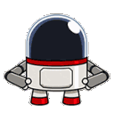

   Hey! Nice to see you.

 こんにちは！ よろしくお願いします。
 

 

 

- 🔭 I’m currently working on Speech Proceesing, Transformers, ASR. 
- 🌱 I’m currently learning Rust, MLOps. 
- 👯 I’m looking to collaborate on Vision Transformer. 
- 💬 Ask me about AI. 

